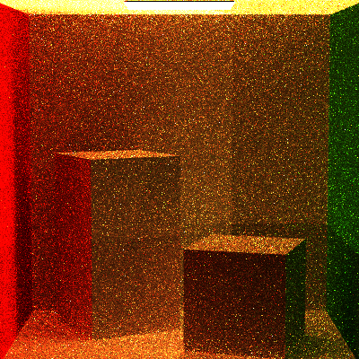

# CIS561_FINAL Bidirectional Lighting

Cornell Box rendered with 100 samples per pixel and 5 bounces.
This is the most naive version, more render results will be available later on.

## Algorithm

Different from the book's algorithm, which totally changed the structure and takes a lot of time, what I did finally saved much more computation.(And much more Stable!) 

The book's algorithm is like photon mapping, first shoot a lot of photons(Vertex) into the scene, and then shoot camera rays. Each ray bounce will randomly select a vertex from the light photon's library.

So what's the difference between this and shoot only 1 light ray and 1 camera ray at each time, then try to connect their nodes? 

This is a simple illustration of my algorithm. For each sample time in each pixel, we shoot a camera ray and randomly select a light and use Sample_Le to shoot a light ray. 

And then, compute and record their bounces in the scene, until we met the bouncing limit. 

Loop all the bouncing buffer, try connect each of them, and then multiply up all the f*dot/pdf along this part, and then multiply the Le we got from the light.

This promises a more stable result than the book's algorithm, and we saved a lot of memory. 
