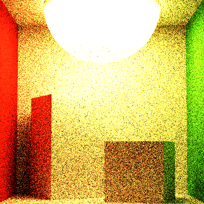

# CIS561_FINAL Bidirectional Lighting

Cornell Box(light prisoned in a double sided box), rendered with 100 samples per pixel and 5 bounces.

## Algorithm

Different from the book's algorithm, which totally changed the structure and takes a lot of time, what I did finally saved much more computation.(And much more Stable!) 

The book's algorithm is like photon mapping, first shoot a lot of photons(Vertex) into the scene, and then shoot camera rays. Each ray bounce will randomly select a vertex from the light photon's library.

So what's the difference between this and shoot only 1 light ray and 1 camera ray at each time, then try to connect their nodes? 

This is a simple illustration of my algorithm. For each sample time in each pixel, we shoot a camera ray and randomly select a light and use Sample_Le to shoot a light ray. 

And then, compute and record their bounces in the scene, until we met the bouncing limit. Notice that when pushing the camera ray intersections into buffer, we modify "beta" after the push. This is because in the connection, which is a fixed direction BSDF, we need to calculate f at this point, so the f term will be dependent on which light ray we will connect to, and multiply its own f here will lead to wrong results.

Loop all the bouncing buffer, try connect each of them, and then multiply up all the f * dot/pdf along this part, and then multiply the Le we got from the light. 

At the end, we need to divide the final L by (depth * depth), this is because in each sample, it is equal that we did depth*depth times of Naive path tracing(Although some of them may not be successful). But since in the Integrator, all Naive path tracing results are sum up and divided by sample times. So, to maintain a same illumination level, we need to do the same thing.

This promises a more stable result than the book's algorithm, and we saved a lot of memory. 

## Why Bidirectional? 

The essence of (Naive)Path Tracing is in fact searching in a large space, both mathematically and physically. The only "meaningful"
results are those rays who hit the area light. 

Different from other blackbox searchings, in path tracing we know the position of the lights, which means we know where to find the results. So what's left is just how to find it. That's how Bidirectional Path Tracing works.

Theorically, if Naive path tracing's wasted rates(rays didn't reach the light, return black) is N%, Bidirectional Path Tracing's wasted rate can be reduced to (N/2)%. In this way, we can use less spp(sample per pixel) to achieve the same results.

Here're 3 images I rendered: Naive, Full Lighting, and Bidirectional.

## Dealing with Transmissive Objects

A common use of Bidirectional Path Tracing is to deal with those scenes where light sources are prisoned within some shells, like light shields. Here're 2 pairs of images rendered with Naive and Bidirectional: 

And this is the 1K version: 

## Known Errors

Perhaps this scene is challenging: 3 square plane lights are covered by a transmissive sphere, these lights are almost pure red, pure blue and pure green. I don't know how it should look like, but I'm pretty sure this result is NOT right. 

Besides, I tried to render it using Naive and Full Lighting, the results are even worse.
